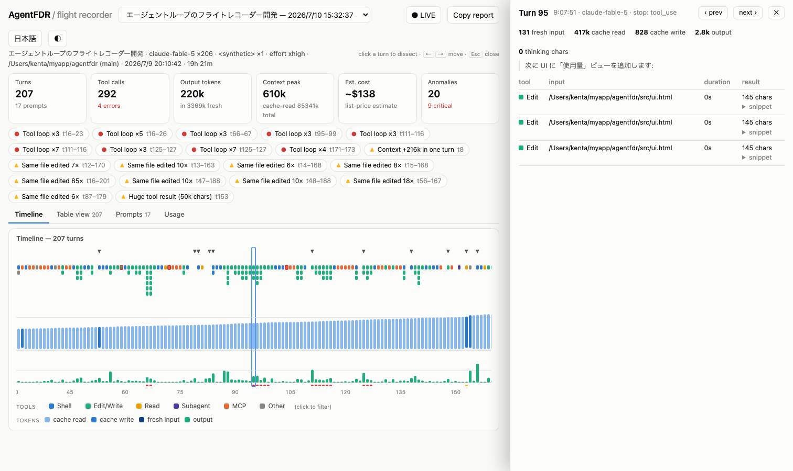
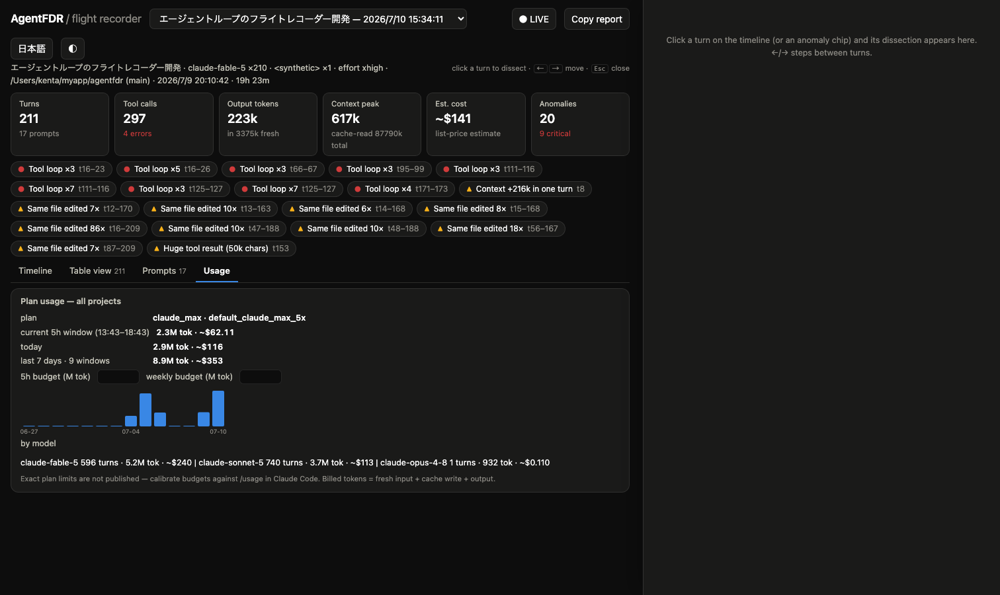

# agentfdr

**Flight data recorder for local coding agents.**
When Claude Code loops, drifts off-goal, or quietly burns two million tokens, `agentfdr` shows you *why* — turn by turn, after the fact.

*日本語版 README は [README.ja.md](README.ja.md) へ。UI・CLI とも日本語対応です。*

```
npx agentfdr
```

That's the whole setup. Your sessions are already recorded — Claude Code writes a full transcript of every session to `~/.claude/projects/`. `agentfdr` reads those transcripts and turns them into something a human can investigate: a timeline of every turn's tool calls, token consumption, context growth, and stop decisions, with known failure patterns flagged automatically.

**Zero instrumentation. Zero cloud. Zero config.** Nothing is sent anywhere; the viewer binds to `127.0.0.1` and reads files you already have.

<picture>
  <source media="(prefers-color-scheme: dark)" srcset="assets/screenshot-dark.png">
  
</picture>

## Why

Autonomous agent failures are hard to debug because the evidence is gone by the time you notice:

- *The loop* — edit → test fails → same edit, for 40 minutes
- *The drift* — you asked for a bugfix, it refactored the router
- *The burn* — a huge tool result crowds the context, cache stops hitting, every turn re-reads 200k tokens
- *The bad landing* — "Done!" with failing tests, or no stop at all

Existing LLM observability tools (LangSmith, Langfuse, AgentOps) assume **you instrument your own app with their SDK and send traces to their cloud**. A prebuilt local agent like Claude Code offers no instrumentation point — but it doesn't need one. The data is already on disk. What's missing is the crash investigator's toolkit. This is that toolkit.

## Commands

```
agentfdr                    # open the newest session's timeline in your browser
agentfdr list               # all recorded sessions across all projects
agentfdr open 35cb18        # open a session by id prefix (or path to a .jsonl)
agentfdr watch              # same, but live: the timeline follows the running session
agentfdr blame 35cb18       # markdown autopsy — paste it into an issue
agentfdr stats              # token totals + estimated cost per project
agentfdr usage              # plan usage: 5h window / daily / weekly burn
agentfdr assert --no-loops --max-tokens 2M   # CI gate: exit 1 on violation
```

Options: `--port <n>` (auto-falls-back if taken), `--no-browser`, `--json`, `--lang en|ja` (auto-detected from `LANG`).

`assert` checks (any combination; exit code 1 if one fails): `--no-loops`, `--no-critical`, `--max-errors <n>`, `--max-turns <n>`, `--max-tokens <n>` (fresh input + cache write + output; accepts `500k` / `2M`), `--max-cost <usd>`.

In the viewer: the **dissection panel** lives on the right (always visible on wide screens; slides in on narrow ones) — click a turn and it fills in, and the timeline stays visible so you can step through turns (**←/→**, **Esc** deselects) without losing your place. Drag the panel's left edge to resize it; the width persists. Tabs switch the main view: **Timeline / Turns / Prompts / Usage**; clicking a prompt or an anomaly chip jumps back to the timeline at that turn. Click a tool color in the legend to filter the tools lane. **Copy report** puts the blame markdown on your clipboard; **● LIVE** re-fetches while the session is still running (on automatically via `agentfdr watch`). Language (日本語/English) and theme toggles are in the header; everything persists.

## What you get

**Timeline** — one screen for the whole session, per turn:
- *Tools lane*: every tool call as a colored block, errors ringed in red
- *Context lane*: stacked context-window composition (cache read / cache write / fresh input) — watch it grow, watch compaction reset it
- *Output lane*: output tokens per turn
- Markers for user prompts and compaction events; hover any turn for the full readout, click for the dissection: usage breakdown, assistant text, every tool call with duration, result size, and result snippet

**Session readout** — the header line lists every model that produced a turn (with per-model turn counts when the session switched models), the number of fast-mode turns, and the effort level. A caveat on effort: it is not a structured field in the transcript, so it's recovered from `/effort` command output and only appears when the level was set during the session.

**Cost estimate** — each session (and `stats`/`blame`) shows an estimated USD cost computed from list prices per model, with cache reads at ≈0.1× and cache writes at ≈1.25× the input price. It's an estimate: discounts, batch tiers, and price changes aren't visible in the transcript. Unknown models are excluded and flagged.



**Plan usage** — `agentfdr usage` (and the **Usage** panel in the viewer) aggregates every project's transcripts into the same shape your subscription is metered in: the current 5-hour rolling window, per-day history, and the rolling week, plus a per-model breakdown. Your plan tier (e.g. `claude_max · default_claude_max_5x`) is read from Claude Code's local config. Anthropic doesn't publish exact token limits, so you set your own budgets (`--budget-5h` / `--budget-week`, env `AGENTFDR_BUDGET_5H` / `AGENTFDR_BUDGET_WEEK`, or inputs in the viewer) and calibrate them against Claude Code's `/usage` screen — agentfdr then shows % consumed with warning colors.

**Anomaly flags** — heuristics that answer "where do I look first?":

| Flag | Meaning |
|---|---|
| `loop` | The same tool-call sequence repeated 3+ times consecutively |
| `error-streak` | 3+ consecutive tool calls failed |
| `context-bloat` | A single tool result ≥50k chars landed in context |
| `token-spike` | Context jumped >60% (+50k) in one turn |
| `cache-thrash` | Consecutive turns paying full price, zero cache hits |
| `file-churn` | The same file edited 6+ times |
| `refusal` | A turn ended with `stop_reason: refusal` (safety decline) |

**Blame report** — `agentfdr blame` renders the same analysis as markdown, ready for an issue or a Slack thread.

## How it works

Claude Code appends every event of a session — user prompts, assistant messages with full token usage, tool calls, tool results, compaction, mode changes — to a JSONL transcript under `~/.claude/projects/<project>/<session-id>.jsonl`. `agentfdr` parses that into a normalized turn model and runs the detectors over it. That's it: no daemon, no database, no runtime dependencies (Node ≥18 standard library only).

The transcript format is not a published API, so the parser is written to survive it: unknown line types become meta events, malformed lines are counted and skipped, and schema changes are contained in one adapter module.

## Privacy

Transcripts contain your code, your prompts, and your file paths. Therefore:
- everything runs locally; the server binds to `127.0.0.1` only
- there is no telemetry, no phone-home, no account
- `blame` output goes to stdout — you decide what leaves the machine

## Roadmap

- [x] Watch mode (`agentfdr watch`) with live timeline
- [x] CI gate — `agentfdr assert --no-loops --max-tokens 2M`
- [x] Cost estimation from per-model list prices
- [ ] Session diff — compare the failed attempt with the successful retry
- [ ] Adapters for other agents (Codex CLI, Gemini CLI, OpenHands, Aider) behind a common event schema
- [ ] Subagent/sidechain tree rendering
- [ ] Pluggable detector rules (YAML)

## Development

```
git clone https://github.com/kamihork/agentfdr.git && cd agentfdr
node --test test/        # run tests
node bin/agentfdr.js     # run the CLI from source
```

`src/ui.html` is served fresh on every request — edit it and reload the browser, no restart needed.

Contributions welcome — especially adapters for other agents and new detector heuristics. See [CONTRIBUTING.md](CONTRIBUTING.md).

## License

[Apache-2.0](LICENSE)
